# 🔥 Reddit Trends Pipeline

[](https://python.org)
[](https://spark.apache.org)
[](https://prefect.io)
[](https://docker.com)
[](https://postgresql.org)

Pipeline ETL completo para análisis de tendencias del dataset de Reddit sobre Cambio Climático. Procesa millones de comentarios usando **Apache Spark** distribuido, orquestado con **Prefect**, almacenado en **MinIO** y visualizado con **Metabase** y **Power BI**.

---

## 📋 Tabla de Contenidos

- [Características](#-características)
- [Arquitectura](#-arquitectura)
- [Flujo del Pipeline](#-flujo-del-pipeline)
- [Requisitos](#-requisitos)
- [Instalación](#-instalación)
- [Uso](#-uso)
- [Estructura del Proyecto](#-estructura-del-proyecto)
- [Servicios y Puertos](#-servicios-y-puertos)
- [Análisis Disponibles](#-análisis-disponibles)

---

## ✨ Características

- 📥 **Ingesta automatizada** desde Kaggle API
- ⚡ **Procesamiento distribuido** con Apache Spark (Master + 2 Workers)
- 🗄️ **Almacenamiento S3-compatible** con MinIO
- 🔄 **Orquestación de flujos** con Prefect 3.x
- 📊 **Múltiples análisis**: temporal, sentimiento, engagement, texto
- 🎯 **API REST** con FastAPI
- 📈 **Dashboards BI** con Metabase y Power BI
- 🐳 **Containerizado** con Docker Compose

---

## 🏗️ Arquitectura

### Diagrama C4 - Nivel de Contenedores




---

## 🔄 Flujo del Pipeline

### Pipeline ETL Completo


### Diagrama de Secuencia


## 📦 Requisitos

- **Docker** >= 24.0
- **Docker Compose** >= 2.20
- **Kaggle API Key** (para descargar datasets)
- **16GB RAM** mínimo recomendado (Spark + MinIO + Postgres)

---

## 🚀 Instalación

### 1. Clonar el repositorio

```bash
git clone https://github.com/tu-usuario/reddit-trends-pipeline.git
cd reddit-trends-pipeline
```

### 2. Configurar variables de entorno

Crear archivo `.env` en la raíz del proyecto:

```env
# MinIO
MINIO_ROOT_USER=minioadmin
MINIO_ROOT_PASSWORD=minioadmin123
MINIO_ENDPOINT=http://minio:9000
MINIO_BUCKET=reddit-data

# PostgreSQL
POSTGRES_USER=prefect
POSTGRES_PASSWORD=prefect123
POSTGRES_DB=prefect_db
POSTGRES_HOST=postgres 

# Spark
SPARK_WORKER_CORES=2
SPARK_WORKER_MEMORY=2g
SPARK_MASTER_URL=spark://spark-master:7077

# Prefect
PREFECT_API_URL=http://prefect-server:4200/api
PREFECT_UI_API_URL=http://localhost:4200/api
```

### 3. Configurar Kaggle API

Colocar tu `kaggle.json` en `~/.kaggle/` o configurar variables de entorno:

```bash
export KAGGLE_USERNAME=tu_usuario
export KAGGLE_KEY=tu_api_key
```

### 4. Levantar los servicios

```bash
docker-compose up -d
```

### 5. Verificar servicios

```bash
docker-compose ps
```

---

## 💻 Uso

### Ejecutar el pipeline completo

```bash
# Acceder al Prefect UI
# http://localhost:4200

# Ejecutar flujo de ingesta (trigger manual o programado)
prefect deployment run "Flujo de Ingesta de Reddit/ingesta-deployment"
```

### Acceder a las interfaces

| Servicio | URL | Descripción |
|----------|-----|-------------|
| Prefect UI | http://localhost:4200 | Orquestador de flujos |
| Spark Master | http://localhost:18080 | Dashboard del cluster |
| MinIO Console | http://localhost:9001 | Administración de storage |
| FastAPI Docs | http://localhost:8000/docs | API REST Swagger |
| Metabase | http://localhost:3000 | Dashboards BI |

---

## 📁 Estructura del Proyecto

```
📦 reddit-trends-pipeline/
│
├── 📂 flows/                          # Flujos de Prefect
│   ├── 📂 ingesta/
│   │   ├── flujo_ingesta.py           # @flow: Descarga desde Kaggle
│   │   └── tasks_ingesta.py           # @task: Upload a MinIO
│   ├── 📂 procesamiento/
│   │   ├── flujo_procesamiento_reddit.py  # @flow: Procesamiento Spark
│   │   └── tasks_procesamiento.py     # @task: Análisis distribuido
│   └── 📂 carga_bd/
│       ├── flujo_carga_bd.py          # @flow: ETL a PostgreSQL
│       └── tasks_carga_bd.py          # @task: Carga de resultados
│
├── 📂 src/
│   ├── 📂 api/                        # FastAPI endpoints
│   ├── 📂 config/                     # Settings y configuración
│   ├── 📂 infrastructure/
│   │   ├── 📂 database/               # Conexión PostgreSQL
│   │   ├── 📂 kaggle/                 # Downloader de datasets
│   │   ├── 📂 spark/                  # Session y operaciones I/O
│   │   └── 📂 storage/                # Cliente MinIO
│   ├── 📂 services/
│   │   ├── 📂 analytics/              # Módulos de análisis
│   │   │   ├── trends.py              # Análisis temporal
│   │   │   ├── sentiment.py           # Análisis sentimiento
│   │   │   ├── engagement.py          # Controversia
│   │   │   ├── anomalies.py           # Detección de picos
│   │   │   ├── text_analysis.py       # Palabras clave
│   │   │   └── reporting.py           # Comparativas
│   │   └── 📂 loader/                 # Carga a BD
│   └── 📂 utils/                      # Utilidades
│
├── 📂 docker/                         # Dockerfiles
│   ├── 📂 api/
│   ├── 📂 base/
│   ├── 📂 spark/
│   └── 📂 worker/
│
├── 📂 sql/                            # Scripts SQL
│   └── 📂 init/                       # Inicialización BD
│
├── docker-compose.yaml                # Orquestación de servicios
├── prefect.yaml                       # Configuración Prefect
├── tablero.pbix                       # Dashboard Power BI
└── README.md
```

---

## 🌐 Servicios y Puertos

| Servicio | Puerto | Descripción |
|----------|--------|-------------|
| **MinIO API** | 9000 | API S3-compatible |
| **MinIO Console** | 9001 | Interfaz web de administración |
| **Spark Master UI** | 18080 | Dashboard del cluster Spark |
| **Spark Worker 1** | 18081 | UI Worker 1 |
| **Spark Worker 2** | 18082 | UI Worker 2 |
| **PostgreSQL** | 5432 | Base de datos |
| **Prefect UI** | 4200 | Orquestador de flujos |
| **FastAPI** | 8000 | REST API |
| **Metabase** | 3000 | BI Dashboards |

---

## 📊 Análisis Disponibles

El pipeline genera los siguientes análisis sobre los comentarios de Reddit:

### 🕐 Análisis Temporal
- **Tendencias diarias**: Volumen de comentarios por día
- **Patrones horarios**: Actividad por hora del día
- **Detección de anomalías**: Picos inusuales de actividad

### 💬 Análisis de Sentimiento
- **Distribución sentiment vs score**: Correlación entre sentimiento y puntuación
- **Comentarios extremos**: Los más positivos y negativos

### 📈 Análisis de Engagement
- **Controversia por subreddit**: Métricas de engagement por comunidad

### 📝 Análisis de Texto
- **Palabras clave por sentimiento**: Top palabras asociadas a cada sentimiento

### 📋 Reportes Consolidados
- **Comparativa de subreddits**: Métricas comparativas entre comunidades

---

## 🛠️ Tecnologías

| Categoría | Tecnología | Versión |
|-----------|------------|---------|
| Lenguaje | Python | 3.11 |
| Procesamiento | Apache Spark | 3.5 |
| Orquestación | Prefect | 3.x |
| Storage | MinIO | Latest |
| Base de Datos | PostgreSQL | 15 |
| API | FastAPI | Latest |
| BI | Metabase | Latest |
| BI Desktop | Power BI | - |
| Contenedores | Docker Compose | - |

---

## 📄 Licencia

Este proyecto está bajo la licencia MIT. Ver el archivo `LICENSE` para más detalles.

---

## 👥 Contribuir

Las contribuciones son bienvenidas. Por favor, abre un issue primero para discutir los cambios que te gustaría hacer.

---

<p align="center">
  Hecho con ❤️ usando Apache Spark, Prefect y Docker
</p>